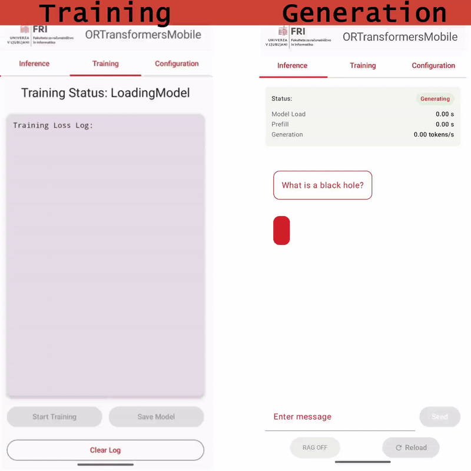
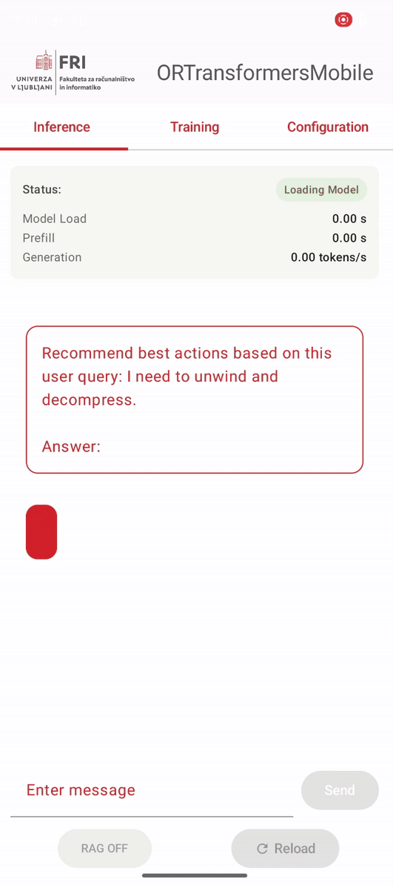

# 📱 MobileTransformers: An On-Device LLM PEFT Framework for Fine-Tuning and Inference

**MobileTransformers** is a modular framework designed for fully **on-device execution** of large and small language models (LLM / SLM) on mobile and edge devices.  
Built on top of **ONNX Runtime**, it leverages hardware-accelerated execution providers such as **XNNPACK**, **NNAPI**, and **QNN** for efficient inference and training on Android and similar platforms.

- **OR**: ONNX Runtime  
- **Transformers**: Core architecture of large language models  
- **Mobile**: Fully on-device mobile execution 


> Example of MobileTransformers Android application running on Google Pixel 6 (2021) with support for on-device LLM training and inference with retrieval-augmented generation.


## 📥 Main links

### Documentation

Installation instructions, training and inference examples, and API documentation.

[MobileTransformers Documentation](https://martinkorelic.github.io/mobiletransformers-docs/)

### Research

For a comprehensive understanding of the research behind MobileTransformers, including detailed explanations of Multi-Adapter Rank Sharing (MARS), on-device training methodologies, and experimental results:

[Master's Thesis - Parameter-Efficient Tuning of Large Language Models on Mobile Devices](https://repozitorij.uni-lj.si/IzpisGradiva.php?lang=eng&id=175561)

### In-repo docs

| Page | Covers |
| --- | --- |
| [docs/ARCHITECTURE.md](docs/ARCHITECTURE.md) | how the host exporter and the Android SDK fit together |
| [docs/EXPORT.md](docs/EXPORT.md) | the one-command export CLI, profiles, flags |
| [docs/MODEL_FORMAT.md](docs/MODEL_FORMAT.md) | the manifest + `weight_handoff_map.json` on-disk contracts |
| [docs/HUB_PACKAGE_FORMAT.md](docs/HUB_PACKAGE_FORMAT.md) | package layout on the Hub; pull/verify/install |
| [docs/ANDROID_SDK.md](docs/ANDROID_SDK.md) | consuming the AAR: install, load, generate, train, merge |
| [docs/ANDROID_CACHE_FORMAT.md](docs/ANDROID_CACHE_FORMAT.md) | where an installed model lives on device |
| [docs/CONFIGURATION.md](docs/CONFIGURATION.md) | the enum vocabulary, typed configs, extension points |
| [docs/PUBLIC_API.md](docs/PUBLIC_API.md) | the Python, CLI and Kotlin public surfaces |
| [docs/RAG.md](docs/RAG.md) | on-device retrieval, ingestion, grounded generation |
| [docs/FEDERATED.md](docs/FEDERATED.md) | federated adapter exchange + the Flower simulation |
| [docs/COMPATIBILITY_MATRIX.md](docs/COMPATIBILITY_MATRIX.md) | per-model support, generated from the matrix |

> `agent_docs/` holds the **implementation plans and audit records** for the ongoing restructure. It is
> working material, not user documentation — start with `docs/` above.

---

## ⚡ Quick start

Everything is driven through `make`; run `make help` for the full target list.

```bash
make setup                    # core + dev environment (uv, Python 3.10)
make check                    # lint + typecheck + enum parity + guards + unit tests

# Export a model to a device-ready package (needs the export profile)
make setup-export
mobiletransformers export --model HuggingFaceTB/SmolLM2-135M-Instruct \
                          --output build/pkg --genai --validate

# Android
make test-jvm                 # SDK JVM unit tests (no device, no NDK)
make test-cpp                 # C++ host unit tests
make android-build            # assemble the SDK + sample app

# On a connected device
make device-package MODEL=<hf-id>   # export, reshape, adb push
make device-test                    # instrumented tests against the pushed package
```

Profiles are deliberately isolated: the `export` extra and the `ort-training-local` group **cannot**
co-install (see [docs/EXPORT.md](docs/EXPORT.md)). Always pass an explicit `--group`/`--extra` to
`uv run`, and reset with `make setup` before running `make check`.

---

## 🚀 What is MobileTransformers?

A comprehensive, privacy-first framework that empowers researchers and developers to export, fine-tune, merge, and deploy transformer-based language models directly on your Android device. Eliminate dependency on cloud services while maintaining full control over your AI models in your pocket.
Perfect for privacy-preserving NLP applications, offline AI assistants, personalized chatbots, and edge computing scenarios where data sovereignty and real-time responsiveness are crucial. Whether you're building the next generation of pocket AI or developing enterprise edge solutions, **MobileTransformers** provides the foundation for truly autonomous mobile intelligence.

**Key Benefits**:

- 🔒 **Complete Privacy**: Your data never leaves your device
- 📱 **Pocket-Sized AI**: Full LLM/SLM capabilities in your smartphone
- 🔧 **Hardware execution provider support**: Hardware-accelerated inference for efficient on-device execution
- 🌐 **Offline-First**: Works anywhere, anytime, without internet connectivity
- 🤖 **Universal Model Support**: Compatible with most custom LLMs/SLMs from Huggingface

---

## 📦 Repository Contents

This comprehensive repository provides everything needed for on-device LLM deployment:

- 🔄 **Export Pipeline**: Streamlined conversion system transforming Huggingface LLMs/SLMs into PEFT-enabled training models and ONNX inference graphs optimized for Android deployment
- 📱 **Complete Android Application**: Full-featured Android folder containing the entire mobile application stack, ready for pocket deployment
- 🧪 **Custom PEFT support**: Customizable PEFT solutions for on-device fine-tuning (e.g. LoRA - Low-rank approximation, MARS - Multi-Adapter Rank Sharing and more)
- 🐍 **Training & Inference Scripts**: Python implementations supporting both PyTorch and ONNX Runtime, optimized for mobile hardware constraints
- 🔬 **Evaluation Scripts**: Comprehensive benchmarking suite for trained models across diverse NLP tasks, including mobile-specific performance metrics and battery consumption analysis

---

## 📱 Android Application: MobileTransformersApp

The Android app is split into two main parts:

- 📲 **Kotlin UI Layer**  
  A lightweight interface acting as a communication bridge, calling APIs from the backend on the mobile device

- ⚙️ **Backend: MobileTransformers**  
  The core engine of the entire framework, implemented in **Kotlin and C++**. Can be easily implemented in re-used in another application, pick and choose which features you need.

🔧 Key features include:  
  - **Modular Android Project**: Clean separation of concerns with isolated modules for **training**, **inference**, **RAG** and **weight management** 
  - **Hardware-Accelerated Loops**: **On-device training / fine-tuning** and generation loops leveraging NNAPI, XNNPACK, and Qualcomm QNN for optimal mobile performance
  - **Dynamic Configuration**: Real-time customization of training parameters and inference settings tailored to your Android device's capabilities
  - **ONNX Runtime Integration**: Optimized model execution specifically tuned for mobile and edge hardware 
  - **Weight Management**: **On-device weight merging** with automatic export to **Android filesystem**, enabling model personalization without cloud dependency
  - **Seamless Model Loading**: Direct import of merged weights into inference graphs for immediate pocket deployment
  - **RAG support**: Support for **Retrieval-Augmented Generation (RAG)** using **ObjectBox** as a fast **on-device vector database**


---

## ✅ Key Capabilities

| Feature                                     | Description                                                        |
|---------------------------------------------|------------------------------------------------------------------|
| ✅ Export **custom PyTorch Huggingface SLM / LLM models** | Convert Huggingface models with PEFT methods to training & ONNX inference models for on-device use |
| ✅ On-device **fine-tuning/training** loop       | Perform parameter-efficient training (PEFT) directly on mobile devices |
| ✅ On-device **generation** loop with KV caching | Efficient text generation using cached key-value tensors for faster autoregressive inference |
| ✅ **Customizable** training and generation      | Flexible configuration to adapt training and generation to specific tasks and hardware |
| ✅ On-device **weight exporting**                 | Save trained or merged weights directly on-device (mobile filesystem) |
| ✅ On-device **weight merging**                    | Merge base and PEFT weights on-device, with optional quantization for optimized size and speed |
| ✅ Direct inference from **merged weights**       | Load merged weights into the inference graph for seamless on-device model execution |
| ✅ **Retrieval-Augmented Generation** (RAG)       | Fully on-device vector database integration with ObjectBox for augmented generation |

---

## 🔧 On-device example

Example of a model being adapted to a personalized smartphone automation dataset where users express intents and the model recommends appropriate automatic actions to perform on the device. This task-oriented dataset is specifically designed for on-device intelligence scenarios.

|🧩 Base Model	|⚙️ On-device Fine-tuned model|
|----|----|
|||

> This example shows how a base model can be fine-tuned and personalized entirely on-device, meaning no data ever leaves the device. During the process, adapters are trained locally, then merged and integrated into the base model on the mobile phone to produce the final fine-tuned version.

---

## 🛠️ Built On

- [**ONNX Runtime**](https://onnxruntime.ai/) for training/inference and support for mobile-optimized execution providers:  
  - XNNPACK  
  - NNAPI  
  - Qualcomm QNN  
- [**Huggingface Transformers**](https://huggingface.co/) ecosystem compatibility for model export  
- [**ObjectBox**](https://objectbox.io/) for lightweight on-device vector databases in RAG workflows  

---

## 🎯 Why MobileTransformers?

- Fully **on-device** - no cloud dependency, maximizing privacy and minimizing latency 
- Enables **parameter-efficient fine-tuning (PEFT)** on mobile hardware  
- Modular and customizable for research and production use
- Ready for **Android** and adaptable to other edge devices  
- Combines cutting-edge generation techniques with practical on-device deployment  

---

## 🔧 Extensibility and Future Work

MobileTransformers is designed as a flexible platform, allowing easy extension for advanced on-device ML workflows, such as:

- Beyond text generation - classification, sentiment analysis, named entity recognition, question answering, summarization, and custom NLP tasks tailored for mobile use cases
- On-device **reinforcement learning**  
- **Federated learning** leveraging exported merged weights  
- Integration with additional hardware acceleration backends  
- Support for more PEFT methods and quantization techniques  
- Expansion to other mobile platforms and edge systems

---

## Citation

If you are using this framework for your own work, please cite:

```
@misc{mobiletransformers2025,
  author       = {Koreli\v{c}, Martin and Pejovi{\'c}, Veljko},
  title        = {MobileTransformers: An On-Device LLM PEFT Framework for Fine-Tuning and Inference},
  year         = {2025},
  howpublished = {\url{https://gitlab.fri.uni-lj.si/lrk/mobiletransformers}}
}
```

---

## Acknowledgements

This work was supported by the Slovenian Research Agency grant no. N2-0393 approXimation for adaptable diStributed artificial intelligence and grant no. J2-3047 Context-Aware On-Device Approximate Computing.