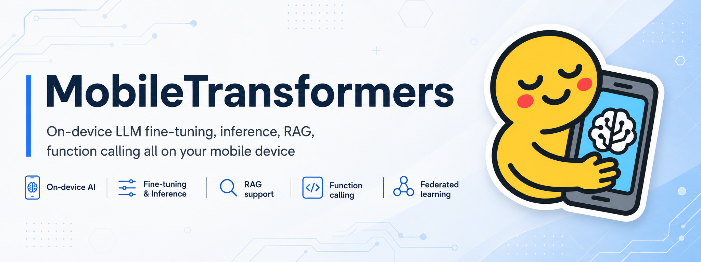
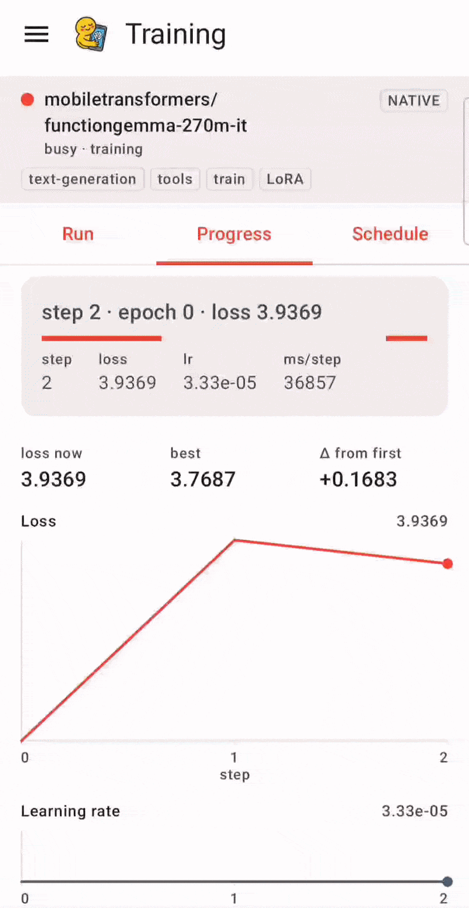
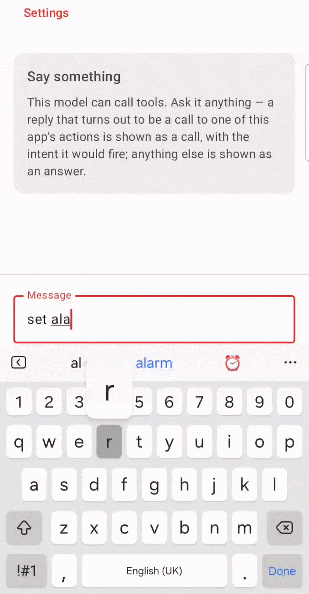
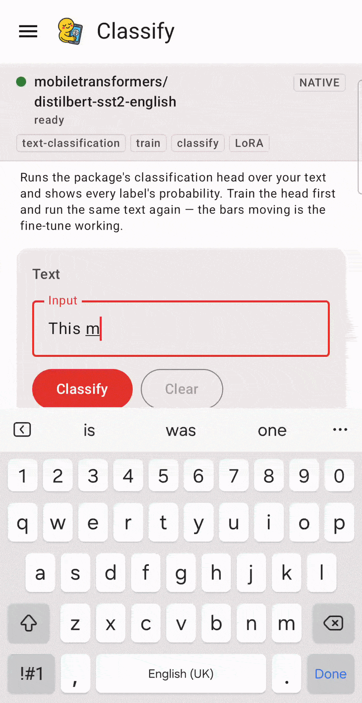

# MobileTransformers: An On-Device LLM PEFT Framework for Fine-Tuning and Inference

[](https://github.com/martinkorelic/mobiletransformers/actions/workflows/checks.yml)
[](pyproject.toml)
[](docs/ANDROID_SDK.md)
[](https://huggingface.co/mobiletransformers)

**Export a Hugging Face model, pull it onto a phone, then chat with it, retrieve over your own
documents, classify text, fine-tune it, merge the adapter into the weights, and let it call tools —
entirely on the device.** No server, no inference API, no data leaving the phone.

Built on **ONNX Runtime**, for both inference *and* training on Android.

---

## Examples

A few of the features, recorded on a phone.

<table>
<tr>
<td width="50%" valign="top">



**Fine-tuning, on the phone.** A LoRA adapter trained against a local dataset — loss falling, step by
step, on the device's own CPU. The adapter is then merged into the weights so the next answer comes
from the fine-tuned model, not from an adapter stacked at runtime.

</td>
<td width="50%" valign="top">



**A sentence becomes an Android action.** The model answers with a structured tool call; the app
validates it against its own allowlist, shows the exact intent it is about to fire, and waits. Accept,
and a real alarm appears in the clock app.

</td>
</tr>
<tr>
<td width="50%" valign="top">


**Grounded in your own documents.** Retrieval runs against a vector store on the phone and reports
what it found — how many passages, from which files — *before* the answer streams in underneath it.

</td>
<td width="50%" valign="top">



**Not only decoders.** A DistilBERT sentiment classifier, scoring text on the device and showing the
probability for every label. Encoders can be fine-tuned here too — that is what makes the bars move.

</td>
</tr>
</table>

More, capability by capability, in **[docs/SHOWCASE.md](docs/SHOWCASE.md)**.

---

## What is actually here

| | |
| --- | --- |
| **A host export pipeline** | Hugging Face → PEFT-enabled training graph + ONNX inference graph + a manifest, in one command |
| **An Android SDK** (Kotlin + C++) | `mobiletransformers-android` — an AAR you can consume from your own app |
| **A sample app** | The reference consumer of that SDK, and the fastest way to see the whole loop |
| **A published model shelf** | Six packages on the Hub, each shipping both an inference and a training stage — including one exported with MARS |
| **Custom PEFT methods** | LoRA, LoRA-XS, and **MARS** (Multi-Adapter Rank Sharing) — the project's own method |
| **Federated adapter exchange** | Export local factors, aggregate on a host, import the average back |

The two things that distinguish this from "run a small model on a phone": **training happens on the
device**, and the trained adapter is **merged into the inference weights on the device**, so the
personalised model is the one that then generates.

## Quick start

```bash
make doctor                   # what is missing, and the command that fixes each
make setup                    # core + dev environment (uv, Python 3.10)
make check                    # lint + typecheck + enum parity + guards + unit tests
```

Export a package and put it on a phone:

```bash
make setup-export
mobiletransformers export --model HuggingFaceTB/SmolLM2-135M-Instruct \
                          --output build/pkg --genai --validate

make device-package MODEL=HuggingFaceTB/SmolLM2-135M-Instruct TRAIN=1 RAG=1
make device-test
```

Or build the app and install a package from the Hub inside it:

```bash
make fetch-native-deps        # the gitignored Android natives — see below
make android-build
```

Dependency profiles are deliberately isolated: the `export` extra and the `ort-training-local` group
**cannot** co-install. Always pass an explicit `--group`/`--extra` to `uv run`, and reset with
`uv sync --frozen --group dev --python 3.10` before `make check` — a leftover profile is the single
most common way to "break" the repo. See [docs/EXPORT.md](docs/EXPORT.md).

> **A fresh clone cannot build the Android SDK on its own.** ~180 MB of prebuilt native binaries and
> vendored headers are gitignored. `make doctor` tells you what is missing; `make fetch-native-deps`
> gets it. See [docs/ARCHITECTURE.md ▸ Native dependencies](docs/ARCHITECTURE.md).

## The model shelf

Six packages under [`mobiletransformers`](https://huggingface.co/mobiletransformers) on the Hub.
Every one ships **both an inference and a training stage** — a shelf entry that cannot be fine-tuned
demonstrates half the framework, so `scripts/publish_catalog.sh` asserts it.

| model | task | inference | total | features |
| --- | --- | --- | --- | --- |
| [SmolLM2-135M-Instruct](https://huggingface.co/mobiletransformers/SmolLM2-135M-Instruct) | text-generation | 663 MB | 935 MB | inference, train, rag |
| [functiongemma-270m-it](https://huggingface.co/mobiletransformers/functiongemma-270m-it) | text-generation | 3557 MB | 3875 MB | inference, train |
| [gemma-3-270m-it](https://huggingface.co/mobiletransformers/gemma-3-270m-it) | text-generation | 1814 MB | 2131 MB | inference, train (**MARS**) |
| [Qwen2.5-0.5B-Instruct](https://huggingface.co/mobiletransformers/Qwen2.5-0.5B-Instruct) | text-generation | 2554 MB | 3212 MB | inference, train, rag |
| [all-MiniLM-L6-v2](https://huggingface.co/mobiletransformers/all-MiniLM-L6-v2) | text-classification | 94 MB | 214 MB | inference, train, rag |
| [distilbert-sst2-english](https://huggingface.co/mobiletransformers/distilbert-sst2-english) | text-classification | 270 MB | 361 MB | inference, train |

Sizes are measured off each pushed package's manifest, not estimated. Start with **SmolLM2**. Full
detail, and why the encoders are exported as `text-classification`, in
[docs/CATALOG.md](docs/CATALOG.md).

## The sample app

Eight destinations, and which you see depends on what the loaded package can actually do — a chat box
on an embedding model is a promise the package cannot keep, so it is hidden rather than greyed out.

**Models** → **Chat** (streaming, grounded answers, tool calls) → **Retrieval** → **Classify** →
**Train** (live loss curve, then merge) → **Federated** → **Configuration** → **About**.

[docs/SHOWCASE.md](docs/SHOWCASE.md) is the tour: one section per capability, the package each needs,
and what you should see.

## Documentation

| Page | Covers |
| --- | --- |
| [docs/SHOWCASE.md](docs/SHOWCASE.md) | a tour of the sample app, capability by capability |
| [docs/CATALOG.md](docs/CATALOG.md) | the published packages: sizes, features, which to start with |
| [docs/ARCHITECTURE.md](docs/ARCHITECTURE.md) | how the host exporter and the Android SDK fit together; native dependencies |
| [docs/EXPORT.md](docs/EXPORT.md) | the one-command export CLI, profiles, per-task flag rules |
| [docs/MODEL_FORMAT.md](docs/MODEL_FORMAT.md) | the manifest + `weight_handoff_map.json` on-disk contracts |
| [docs/HUB_PACKAGE_FORMAT.md](docs/HUB_PACKAGE_FORMAT.md) | package layout on the Hub; pull/verify/install |
| [docs/ANDROID_SDK.md](docs/ANDROID_SDK.md) | consuming the AAR: install, load, generate, classify, retrieve, train, merge |
| [docs/COOKBOOK.md](docs/COOKBOOK.md) | copy-pasteable Kotlin per task, mirroring the app's screens |
| [docs/ANDROID_CACHE_FORMAT.md](docs/ANDROID_CACHE_FORMAT.md) | where an installed model lives on device |
| [docs/CONFIGURATION.md](docs/CONFIGURATION.md) | the enum vocabulary, typed configs, extension points |
| [docs/PUBLIC_API.md](docs/PUBLIC_API.md) | the Python, CLI and Kotlin public surfaces |
| [docs/RAG.md](docs/RAG.md) | on-device retrieval, ingestion, grounded generation |
| [docs/FEDERATED.md](docs/FEDERATED.md) | federated adapter exchange + the Flower simulation |
| [docs/COMPATIBILITY_MATRIX.md](docs/COMPATIBILITY_MATRIX.md) | per-model support, generated from the matrix |
| [docs/RELEASE_CHECKLIST.md](docs/RELEASE_CHECKLIST.md) | what a release requires |
| [docs/mobile_evaluation.md](docs/mobile_evaluation.md) | host-side evaluation of on-device runs |
| [docs/getting-started.md](docs/getting-started.md) | three routes in: run the app, consume the SDK, export a model |
| [docs/on-device-peft.md](docs/on-device-peft.md) | LoRA, LoRA-XS and MARS, and what each costs on a phone |

**All of the above is published as a searchable site at
[martinkorelic.github.io/mobiletransformers](https://martinkorelic.github.io/mobiletransformers/).**

## Built on

- [**ONNX Runtime**](https://onnxruntime.ai/) — training and inference, with XNNPACK / NNAPI /
  Qualcomm QNN execution providers
- [**Hugging Face Transformers**](https://huggingface.co/) + [**Optimum**](https://huggingface.co/docs/optimum/)
  — model export
- [**ObjectBox**](https://objectbox.io/) — the on-device vector database behind RAG

## Where this is going

- Beyond generation and classification: NER, question answering, summarization
- On-device reinforcement learning
- More PEFT methods and quantization techniques
- Additional hardware acceleration backends, and platforms beyond Android

## References

- [**Original codebase**](https://gitlab.fri.uni-lj.si/lrk/mobiletransformers) — the address this
  work was published under, and the one the citation below names.
- [**Master's Thesis — Parameter-Efficient Tuning of Large Language Models on Mobile Devices**](https://repozitorij.uni-lj.si/IzpisGradiva.php?lang=eng&id=175561)
  — the research behind MARS, the on-device training methodology, and the experimental results.
- [**AI health agents on mobile**](https://link.springer.com/article/10.1186/s12919-026-00367-3#Sec27),
  *BMC Proceedings* 2026, 20(12):A7 (EHRCON25 — openEHR International Conference).
  The first on-device RAG prototype over openEHR personal health records: a small language model, an
  embedding model and a vector database of vital signs, medications, allergies and lab results, all
  running on the phone. Built on this framework.

## Citation

If you are using this framework for your own work, please cite:

```
@misc{mobiletransformers2025,
  author       = {Koreli\v{c}, Martin and Pejovi{\'c}, Veljko},
  title        = {MobileTransformers: An On-Device LLM PEFT Framework for Fine-Tuning and Inference},
  year         = {2025},
  howpublished = {\url{https://gitlab.fri.uni-lj.si/lrk/mobiletransformers}}
}
```

## Acknowledgements

This work was supported by the Slovenian Research Agency grant no. N2-0393 approXimation for adaptable diStributed artificial intelligence and grant no. J2-3047 Context-Aware On-Device Approximate Computing.
