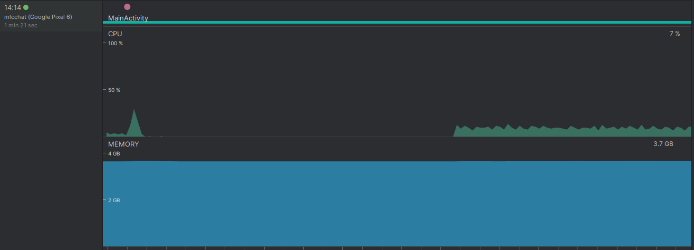
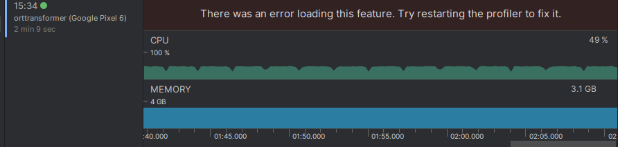

# On-device LLM finetuning research

> Summer 2024 - Martin Korelič

## Overview

- `android`
    - `TFLiteTransformer` - example Android app with TFLite transformer for on device learning
    - `ORTTransformer` - example Android app with ONNX Runtime transformer for on device learning
- `onnx_genai_config` - example of ONNX GenAI configuration files
- `onnx_genai_test.py` - to test the models with ONNX GenAI framework
- `convert_kerasnlp_tflite.py` - script for converting the KerasNLP models to TFLite format with training and inference signatures
- `optimum_export.py`- script for converting the Huggingface models to ONNX format with training and inference capabilities
- `convert_onnx_artifacts.py` -  script for converting ONNX format to training artifacts for on device learning 

## Results

### TensorflowLite - Gemma 2B with LoRA rank 4

- Testing device: Google Pixel 6 (~7GB RAM)
- Original size of model: 10 GB
- Quantized version of exported model: 5.7 GB

Other models were not able to be exported via Keras.
Problems with running inference and training, running out of memory.
When training with unlimited memory, the training step did not end and it ended up taking more and more memory over time.


### ONNX Runtime - Quantized TinyLlama with LoRA rank 4

- Testing device: Google Pixel 6 (~7GB RAM)
- Original size of model: 4.4 GB
- Quantized version of exported model: 1.7 GB
    - LoRA with rank 4 is applied to all `q_proj` and `k_proj` layers
    - Applied dynamic quantization to every layer except LoRA layers and embed token layer

#### Training
Single training step of small data set with batch size of 4.

Memory usage: ~3.7 GB

Time elapsed: 3-4 seconds



#### Inference with no KV caching
Inference generation with no KV caching

Memory usage: ~3.1 GB

Time per token generation: ~1-2 seconds (increases with sequence length)



### Inference with KV caching (ONNX GenAI)
Inference generation KV caching

Memory usage: ~2.6GB

Time per token generation: ~0.3-0.8 seconds (does not increase with sequence length)

### Saving the model checkpoint and transferring weights
This step involves loading the modified weights into memory and saving the rest of the updated weights to the checkpoint.

Memory usage: ~5.2GB

## Interesting findings and issues

### Incorrect generation with ONNX GenAI after transfering weights

Somehow not loading in properly, need to remove constants also as intializers from the weight data, as one weight data file might include them while the other may not. Can lead to different and incorrect results. In the case of multiple external data this issue does not appear.

Tested with TinyLlama:

- Using a single tensor file export with ONNX GenAI:

```
Hello how is your day going?ittelittelittelzerzerzerzer pró pró pró pró pró pró pró pró pró
próoreoreoreore pró pró pró pró pró pró pró pró pró pró pró pró pró próoreoreoreore pró pró pró pró pró pró pró pró pró pró
pró pró pró pró pró pró pró pró pró pró pró pró pró pró pró pró pró pró pró pró pró pró pró pró pró pró pró pró pró pró pró pró pró
pró pró pró pró pró pró pró pró pró pró pró pró pró pró pró pró pró pró pró medium medium medium medium medium medium medium medium
medium medium medium medium medium medium medium medium medium medium medium medium medium medium medium medium medium medium
```

- Using multiple layers export with ONNX GenAI:

```
Hello how is your day going?
give me a call and i will be happy to help you.
I am a 20 year old female who is looking for a job. I am a hard worker and I am very reliable.
I am looking for a job that will allow me to work from home. I am looking for a job that will allow me to work from home.
I am looking for a job that will allow me to work from home. I am looking for a job that will allow me to work from home.
```

### Difference in generation with ONNX GenAI with KV caching and without

- Using ONNX GenAI with inference model
- Faster inference as KV caching is used
```
"Hello, this is a message for the world. How is your day?\nI'm doing well, thank you.
I'm doing well, thank you. I'm doing well.
I'm doing well, thank you. I'm doing well. I'm doing well.
I'm doing well, thank you. I'm doing well. I'm doing well. I'm doing well.
I'm doing well, thank you. I'm doing well. I'm doing well. I'm doing well. I'm doing well...
```

> Repeating sentences since greedy sampling is used.

- Using manual ONNX Runtime inference without ONNX GenAI
- Much slower generation, time for inference increases everytime as the sequence gets longer - no KV caching is implemented in this case

```
Hello, this is a message for the world. How is your day? We are having a lot of daytime rain and this rain has given us several inches of snow here in Minnesota.
Where are we now?? We moved into our new home two weeks ago. I still have
```

## Problems

- ONNX GenAI with transferring weights

ONNX GenAI framework currently does not allow adding the weights to the inference session (or does not expose the session options) for the user, therefore the updated weights cannot be to the inference model for generation.
Request open for this feature:

https://github.com/microsoft/onnxruntime-genai/issues/859#issuecomment-2325923159

If not, then another option would be to save the model somehow from the created inference session with updated weights loaded in.
This is currently only possible to achieve in Python but not in Android Java/C++ as no option to save or export model is explicitly defined in Java or C++.

**This was solved**: I created a different kind of inference graph and saved it separately to the device, which has inputs set to accept updated weights from the checkpoint state memory. However, this creates more memory overhead as the weights need to be also copied to memory before they are transferred to GenAI inference graph, while the other frozen weights are discarded before to preserve memory.
> Is there a more efficient way to save the model checkpoint?

- No separate tokenizer for ONNX GenAI

When creating the tokenizer for ONNX GenAI, we need to provide a dummy ONNX model that will create the Model class which provides the tokenizer. There is no option to create tokenizer separately.

- Optimum export for training

When exporting with optimum for training, no such option is added to the model kwargs. This needs to be manually added when exporting for training or inference: `training=torch.onnx.TrainingMode.PRESERVE` in function:

`from optimum.exporters.onnx.convert import export_pytorch`

- Export model for inference is a memory bottleneck

When the model is done training on device, we can use export model for inference to create a new model from the current training session, however it uses a lot of memory to export.
This could be avoided by already having an inference model and then transfering weights to the inference session.

## Future developments

TODOs:

- Add command line arguments for the scripts
- ~~Compatibility of creating the inference model for GenAI framework for on device inference~~
- Testing inference with Android NNAPI in ONNX Runtime
- Optimizations
    - PyTorch optimizations in the model before export
    - [Advanced ONNX training](https://onnxruntime.ai/docs/api/python/on_device_training/training_artifacts.html#advanced-usage)
    - On-device training optimizations with ONNX Runtime training

## Useful references

- Building ONNX Runtime training from source

Follow the instructions in their documentation and github.

Since some features are available only in latest builds which are not yet release on pip wheel packages we need to build the wheel packages ourselves from the `onnxruntime-training` source.

If problems with building libraries:
```
export CMAKE_ARGS="-DONNX_USE_PROTOBUF_SHARED_LIBS=ON"
./build.sh --config RelWithDebInfo --build_shared_lib --parallel --enable_training --build_wheel --cmake_extra_defines FETCHCONTENT_TRY_FIND_PACKAGE_MODE=NEVER --compile_no_warning_as_error --skip_submodule_sync
python -m pip install build/Linux/RelWithDebInfo/dist/*.whl
```
After building, do not install any onnxruntime packages from pip or it will destroy the onnxruntime-training that was built from source. Install other onnxruntime packages in another environment.

If problems with linking libraries (numpy or other):
```
sudo ln -s /path/to/anaconda3/envs/onnx-venv/lib/python3.12/site-packages/numpy/core/include /usr/include/numpy
export CPATH=$(python -c "import numpy as np; print(np.get_include())")
export CFLAGS=-I/path/to/anaconda3/envs/onnx-venv/lib/python3.12/site-packages/numpy/core/include
```

In case OS keeps killing the process when exporting with large memory usage:
```
systemctl disable --now systemd-oomd
```

- Building ONNX GenAI for on device usage

Follow the instructions on their website.

Make sure to have adb connected and ready for emulator test.
```
./build.sh --parallel --build_java --android --android_home=$ANDROID_HOME --android_ndk_path=$ANDROID_NDK --android_api=24 --ort_home=/path/to/onnxruntime-android-1.18.0 --android_run_emulator
```
Add `--android_abi=x86_64` or `--android_abi=arm64-v8a` depending on the device architecture

If recompiling, make sure to delete the build folder and re-run the command again.
AAR package can be found in `"onnxruntime-genai/build/Android/RelWithDebInfo/src/java/build/android/outputs/aar/onnxruntime-genai-debug.aar"`.

There is also an option to build for both platforms:

- [Android ONNX runtime Genai build for Java bindings](https://github.com/microsoft/onnxruntime-genai/blob/main/src/java/AndroidBuild.md)

- [ONNX Runtime GenAI graph optimizations](https://github.com/microsoft/onnxruntime-inference-examples/blob/main/python/models/llama/LLaMA-2%20E2E%20Notebook.ipynb)

- [Phi-3 onnx runtime genai Android](https://github.com/microsoft/onnxruntime-inference-examples/tree/main/mobile/examples/phi-3/android)

- [Federated ONNX runtime training on the web](https://opensource.microsoft.com/blog/2024/02/06/on-device-training-training-a-model-in-browser/)

- [Question Answering Android ONNX Runtime](https://github.com/microsoft/onnxruntime-inference-examples/tree/main/mobile/examples/question_answering/android)

- [Masked language modelling](https://github.com/microsoft/onnxruntime-training-examples/blob/master/on_device_training/desktop/csharp/masked_language_modeling/mobilebert_offline.ipynb)

- [Testing training artifacts in Python](https://github.com/microsoft/onnxruntime-training-examples/blob/master/on_device_training/desktop/python/mnist.ipynb)

- [Transfering weights in C++](https://stackoverflow.com/questions/67301475/parse-an-onnx-model-using-c-extract-layers-input-and-output-shape-from-an-on/67317076#67317076
)